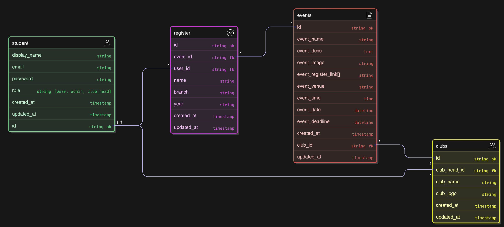

# README

## ER Diagram for Socials



## Installation & Setup
1. Clone the repository:
   ```sh
   git clone https://github.com/ankital-selldo/project.git
   cd project
   ```
2. Install dependencies:
   ```sh
   bundle install
   ```
3. Setup the database:
   ```sh
   rails db:migrate
   ```
4. Start the server:
   ```sh
   rails server
   ```
5. Open the application in your browser:
   ```sh
   http://localhost:3000
   ```